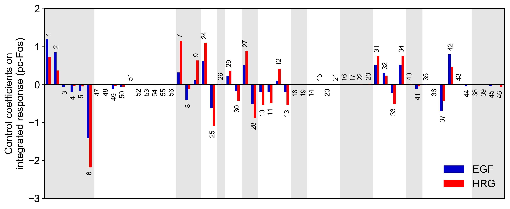

# Sensitivity Analysis
Sensitivity analysis examines how perturbations to the processes in the model affect the output.
***



Control coefficients for *c-fos* mRNA duration and integrated pc-Fos are shown by bars (blue, EGF; red, HRG). Numbers above bars indicate the reaction indices.

## Description
The single parameter sensitivity of each reaction is defined by<br>

*s<sub>i</sub>*(*q*(**v**),*v<sub>i</sub>*) = *∂* ln(*q*(**v**)) / *∂* ln(*v<sub>i</sub>*) = *∂*_q_(**v**) / *∂*_v<sub>i</sub>_ · *v<sub>i</sub>* / *q*(**v**)

where *v<sub>i</sub>* is the *i*<sup>th</sup> reaction rate, **v** is reaction vector **v** = (*v<sub>1</sub>*, *v<sub>2</sub>*, ...) and *q*(**v**) is a target function, e.g., time-integrated response, duration. Sensitivity coefficients were calculated using finite difference approximations with 1% changes in the reaction rates.

## Requirements
- **Python3+**
    - numpy
    - scipy
    - matplotlib
    - jupyter

## Usage
```python
from sensitivity_analysis import visualize_sensitivity

visualize_sensitivity()
```

## Installation
    $ git clone https://github.com/okadalabipr/sensitivity_analysis.git

## References
- Nakakuki, T. *et al.* Ligand-specific c-Fos expression emerges from the spatiotemporal control of ErbB network dynamics. *Cell* **141**, 884–896 (2010). https://doi.org/10.1016/j.cell.2010.03.054

- Kholodenko, B. N., Demin, O. V. & Westerhoff, H. V. Control Analysis of Periodic Phenomena in Biological Systems. *J. Phys. Chem. B* **101**, 2070–2081 (1997). https://doi.org/10.1021/jp962336u

- Kholodenko, B. N., Hoek, J. B., Westerhoff, H. V. & Brown, G. C. Quantification of information transfer via cellular signal transduction pathways. *FEBS Lett.* **414**, 430–434 (1997). https://doi.org/10.1016/S0014-5793(97)01018-1


## License
[MIT](/LICENSE)
